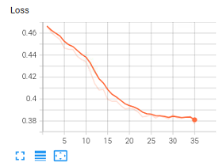
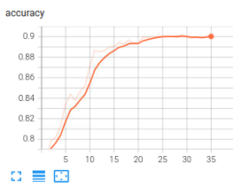
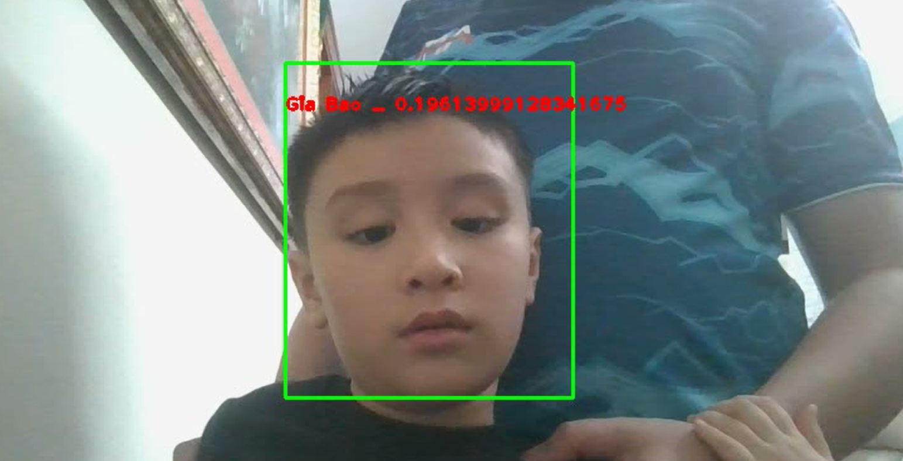

# Face Recognition with semi-herd triplet loss in Pytorch

## Overview

This repository contains code for fine-tuning a face recognition model using the MobilenetV3 or Resnet50 backbone with a semi-hard triplet loss in Pytorch. The model is trained to investigate the ability of face recogntion from a datset, and it uses face dataset obtained from [Kaggle](https://www.kaggle.com/datasets/hoangpham10/celeb-faces/data).

## How to use my code
To reproduce the results, follow the steps below:
1. Clone the repository:
```
git clone https://github.com/HoangPham10/face-recognition-semi-hard-triplet-pytorch.git
```
2. Install the dependencies

3. Prepare dataset
You could download dataset from [Kaggle](https://www.kaggle.com/datasets/hoangpham10/celeb-faces/data) or create them by yourself. 
In case you create yourself, for each person whose faces you want to add to dataset, create a folder with the name as the number label in `data\train(val)` folder, and put all the images of that person in that folder.

4. Train the model:
Edit the `config.py` or `__notebook__.ipynb` if you want to run in jupyter notebook to get the right path for dataset

Run the `__notebook__.ipynb` or use the command:

 `python train.py  --margin 0.5 --n_classes 20 --n_samples 5 --patience 5`

6. Create embeddings for demo:

Create a folder named `anchor` and put the images same as the step 3 (your could use the name of person as folder name instead of index label as the step 3)

Run the command: 
`python demo.py`

7. Some visualizaton
- **loss_curve**
 

- **acc_curve**
 

- **demo**
 

